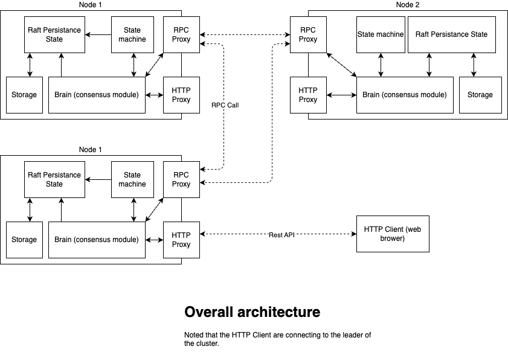

This is a simple distributed key-value database, built on top of [Raft](https://raft.github.io/) consensus algorithm. At the moment, this raft cluster now supports:
- Leader election
- Log replication
- Safety
- Client interaction
- Cluster membership changes (in progress)
- Log compaction (pending)



# 1. Start the cluster
## 1.1 Dynamic cluster (unavailable)
With a dynamic cluster, you can freely add or remove nodes as you want (one at a time). \
The general idea is, firstly you create a one-node-cluster, the only node will obviously become the leader. You can perform all commands with this cluster normally. \
Then you add a new node to the cluster to form a two-nodes-cluster, the new node needs to catch up with the current leader before it officially becomes a member of the cluster. The catching-up can take a long time, and you can only add (or remove) one node to the cluster at a time. \
After the second node is added successfully, now you can add the third node to the cluster. And keep going like that, you can add as much as you want.

> :warning: When you add or remove a node, the quorum is also changed. \
> For a cluster with $n$ nodes, the quorum $q$ can be calculated as:
> $$[ q = \left\lfloor \frac{n}{2} \right\rfloor + 1 ]$$

## 1.1.1 Adding servers to cluster
To create the first node, wait for few seconds and this node will become the leader of a one-node-cluster:
``` bash
go run -race main.go -id=1 -catching-up=false -rpc-port=1234 -http-port=8080
```

To add second node:
Run below command to start the server, the server now is in catching-up mode, is wait to receive log updates from current leader.
``` bash
go run -race main.go -id=2 -catching-up=true -rpc-port=1235 -http-port=8081
```
Send request to add new server to leader, so the leader can start the catching-up process with new server.
``` bash
curl --location 'localhost:8080/cli' \
--header 'Content-Type: application/json' \
--data '{
    "command": "addServer 2 localhost:8081 localhost:1235"
}'
```
The format of command to add a new server to the cluster is:
```
addServer [server id] [http url] [rpc url]
```

To add third Node:
Start the server:
``` bash
go run -race main.go -id=3 -catching-up=true -rpc-port=1236 -http-port=8082
```
Send request to leader:
``` bash
curl --location 'localhost:8080/cli' \
--header 'Content-Type: application/json' \
--data '{
    "command": "addServer 3 localhost:8082 localhost:1234"
}'
```

In case the second or third node is crashed and need to restart, set `catching-up=false` because they have catched up with the current leader.

## 1.1.2 Removing servers to cluster
In case you want to remove a node from the cluster, send an HTTP request to the leader to specify which server you want to remove. The leader can be removed as any other server.
``` bash
curl --location 'localhost:8080/cli' \
--header 'Content-Type: application/json' \
--data '{
    "command": "removeServer 3 localhost:8082 localhost:1234"
}'
```

After the server is removed from the cluster, you need to manually shut it down.
If you want to get a previously removed server to join the cluster again, you need to choose a new ID for it, as you can't reuse the used server IDs.


## 1.2 Static cluster
## 1.2.0 Configuration
For static cluster, you need to describe the member servers of cluster in the file `config.yml` as below:
```yaml
cluster:
  mode: static # the cluster can be either 'static' or 'dynamic'
  servers: # if the mode is 'dynamic', `servers` will be ignored
    - id: 1
      host: "http://localhost"
      http_port: 8080
      rpc_port: 1234
    - id: 2
      host: "http://localhost"
      http_port: 8081
      rpc_port: 1235
    - id: 3
      host: "http://localhost"
      http_port: 8082
      rpc_port: 1236
# timeout in miliseconds
min_election_timeout_ms: 12000
max_election_timeout_ms: 15000
min_heartbeat_timeout_ms: 2000
max_heartbeat_timeout_ms: 5000
```
## 1.2.1 Using multiple terminals (recommended)
In this mode, logs of each node in the cluster will be shown in its terminal.\
To clear the previous state of the cluster: `make clear`\
Open three terminals, and input the three below commands to three terminals respectively:\
Terminal 1 - Node 1: `make nodes1`\
Terminal 2 - Node 2: `make nodes2`\
Terminal 3 - Node 3: `make nodes2`
## 1.2.2 Using one terminal (unavailable)
In this mode, logs of nodes in the cluster will be all shown in one terminal.\
To clear the previous state of the cluster: `make clear`\
Open a terminal, and type: `make run`
# 2. Specify the URL of the leader
After the cluster is started up, a few seconds later there will be an election, and finally a leader will be elected.\
The default cluster will have three nodes, initially, all three nodes are followers, and after a successful election, one of the followers becomes the leader of the cluster.\
At the moment, all of your requests including reading and writing need to go through the leader.\
To find which node is the current leader, you can check its log, recent logs of the leader will have `state=leader`. At the moment node's HTTP URL is hardcoded in `main.go`.
# 3. Interact with the cluster
## 3.1 Register client
This API is to create a session for a current client. To read or write data to the cluster, a session is required. The purpose of the session is to make the requests are idempotent, by assigning a monotonically increasing number.

You need to replace the `localhost:8080` with the leader URL you found in step #2.
```bash
curl --location 'localhost:8080/cli' \
--header 'Content-Type: application/json' \
--data '{
    "client_id": 0,
    "sequence_num": 0,
    "command": "register"
}'
```

If you send the request to the leader, and the request is successful, you will receive a response like the one below. `response` is the id of your session, you need to include this session id in later requests.
```json
{
    "status": "OK",
    "response": 2,
    "leader_hint": ""
}
```

If you send a request to a follower, you most likely received a response which is similar to this:

```json
{
    "status": "Not OK",
    "response": 0,
    "leader_hint": "localhost:8080"
}
```

## 3.2 Send command to cluster
This is a key value database, so you can send a command to the leader to set (or overwrite) the value for a specific key.

- The format of the `command`: [set][a space][key-name][a space][value need to be set]
- Session ID `client_id`: You got this ID in the `response` from step #3.1
- Sequence Number `sequence_num`: The purpose of sequence num is to ensure the idempotent of the request, so you can retry it safely.
After each command you need to increase the sequence num, You need to make sure the sequence num of the later request must be bigger than the former one. \
In case you want to retry the command, keep the sequence number the same.
```bash
curl --location 'localhost:8080/cli' \
--header 'Content-Type: application/json' \
--data '{
    "client_id": 2,
    "sequence_num": 1,
    "command": "set name quoc khanh"
}'
```
If the request goes through the leader and gets processed successfully, the response will be like this:
```json
{
    "status": "OK",
    "response": "quoc khanh",
    "leader_hint": ""
}
```
If you send a request to a follower, you will receive:
```json
{
    "status": "Not OK",
    "response": "NOT_LEADER",
    "leader_hint": "localhost:8080"
}
```
## 3.3 Query data
After set the value for the keys in the previous step, you can now query it:\
Query format: [get][a space][key-name]
```bash
curl --location 'localhost:8080/cli' \
--header 'Content-Type: application/json' \
--data '{
    "client_id": 0,
    "sequence_num": 0,
    "command": "get name"
}'
```
Since we don't need `client_id` and `sequence_num` in this request, so we can set it both as `0`.

If success:

```json
{
    "status": "OK",
    "response": "quoc khanh",
    "leader_hint": ""
}
```

Failed:

```json
{
    "status": "Not OK",
    "response": "NOT_LEADER",
    "leader_hint": "localhost:8080"
}
```